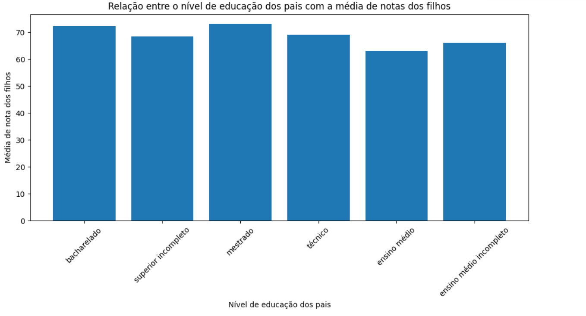

# Projeto de Data Science - UPF 2023/01
## Objetivo do projeto

À partir de um dataset com N dados sobre notas de alunos, o objetivo do projeto é descobrir se existe relação entre a escolaridade de pais e a nota de seus filhos.


## Sobre o dataset

O dataset possui 1000 amostras (linhas), e 8 colunas, sendo elas:
* gender (gênero);
* race/ethnicity (raça/etnia);
* parental level of education (nível de educação dos pais)
* lunch (almoço)
* test preparation course (curso de preparação para a prova)
* math score (nota em matemática)
* reading score (nota em leitura)
* writing score (nota em escrita)

No projeto, foram utilizadas apenas o nível de educação dos pais e a soma das 3 notas do aluno para gerar a relação.

<sup style="display: inline-block;">**O dataset pode ser encontrado no seguinte link:** [Kruggle - Students Performance in Exams](https://www.kaggle.com/datasets/spscientist/students-performance-in-exams)</sup>


## Modelo utilizado
O modelo utilizado foi o de regressão liner, que serve muito bem para prever relações, sendo exatamente esta a ideia do projeto atual.

## Desenvolvimento

### 1- Importanto bibliotecas necessárias

Foram utilizadas as bibliotecas do python:
* Pandas
* Matplotlib
* Sklearn
  
```
import pandas as pd
import matplotlib.pyplot as plt
from sklearn.linear_model import LinearRegression
```

### 2- Lendo os dados necessários

Aqui seleciono apenas as colunas que vão ser utilizadas
```
data = pd.read_csv('StudentsPerformance.csv')

df_selected = data[['parental level of education', 'math score', 'reading score', 'writing score']]
```

### 3- Tradução das colunas para português

Alterei o nome das colunas para no fim gerar o gráfico de barras totalmente em português
```
column_translation = {
    "bachelor's degree": "bacharelado",
    'some college': 'superior incompleto',
    "master's degree": "mestrado",
    "associate's degree": "técnico",
    'high school': 'ensino médio',
    'some high school': 'ensino médio incompleto'
}

df_selected['parental level of education'] = df_selected['parental level of education'].map(column_translation)

```

### 4- Criação da média e treinamento do modelo

Aqui crio a média do aluno somando todas as notas, além de fazer a relação entre as colunas e treinar o modelo de regressão linear
```
df_selected['average_score'] = df_selected[['math score', 'reading score', 'writing score']].mean(axis=1)

df_encoded = pd.get_dummies(df_selected['parental level of education'], prefix='parental level of education')

df_encoded['average_score'] = df_selected['average_score']

X = df_encoded.drop('average_score', axis=1)
y = df_encoded['average_score']

model = LinearRegression()

model.fit(X, y)

education_levels = df_selected['parental level of education'].unique()
df_predictions = pd.DataFrame({'parental level of education': education_levels})
df_predictions = pd.concat([df_predictions, pd.get_dummies(df_predictions['parental level of education'], prefix='parental level of education')], axis=1)
df_predictions['average_score'] = model.predict(df_predictions.drop('parental level of education', axis=1))
````

### 5- Mostrando os dados em um gráfico de barras

```
plt.figure(figsize=(10, 6))
plt.bar(df_predictions['parental level of education'], df_predictions['average_score'])
plt.xlabel('Nível de educação dos pais')
plt.ylabel('Média de nota dos filhos')
plt.title('Relação entre o nível de educação dos pais com a média de notas dos filhos')
plt.xticks(rotation=45)
plt.tight_layout()
plt.show()
```

Como não existem valores nulos e os dados já estão no formato esperado, não foi necessário processar ou normalizar os dados.

## Conclusão e resultado obtido

Como resultado, um gráfico de barras é gerado, onde é possível se observar a média de nota dos alunos (a esquerda), relacionando com a escolaridade dos país (abaixo).

Observa-se que alunos que possuem pais com maior nivel de escolaridade, tendem a ter uma media maior de nota. Por mais que este este comportamento possa parecer óbvio, é interessante comprovar isto utilizando dados reais e tecnicas de data science.

<br>
<br>


